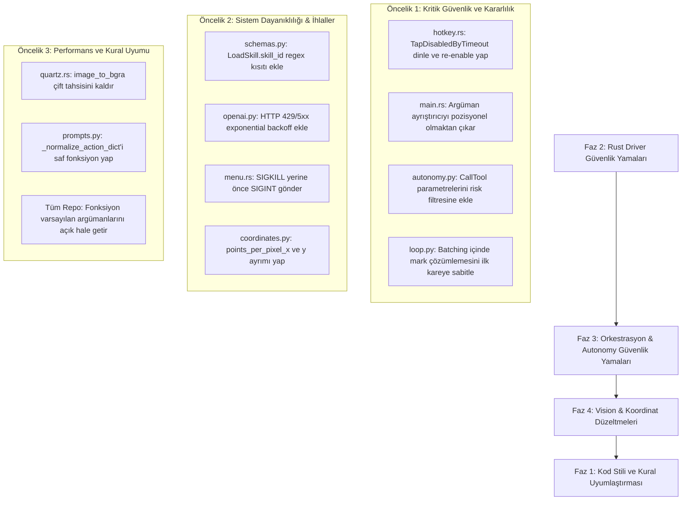

# Kapsamlı Proje Code-Review Raporu

> **Durum (4 Eylül 2026, güncel):** Aşağıdaki bulgular yeniden doğrulandı.
> Ölçülen zemin: `pytest` 717/717, `cargo test` 61 passed + 1 ignored,
> `ruff`/`pyright`/`clippy -D warnings` temiz, `--eval` 12/12.
>
> **Kapatıldı, regresyon testiyle sabitlendi:** CLI-01, SEC-01, SEC-02,
> SEC-03, NET-01, SYS-01, SYS-02, ve rapora sonradan eklenen AUT-02 (ölen
> driver'ı geri getiren yoktu → `orchestrator/supervisor.py`; canlı olarak
> SIGKILL'lenen bir driver geri getirilerek doğrulandı).
> * P3 (Playbook Katmanı) — Diskteki SKILL.md rehberlerini (62 adet) prompt ipucu olarak bağlama (`skills/playbook.py`), YAML folded/literal block scalar ayrıştırıcısı, Law 3 iki aşamalı arama + tekil-en-yüksek playbook entegrasyonu (`loop.py`), `<observed_data>` içi HINT çerçevesi ve sızıntı koruması (`prompts.py`), `test_playbook.py` smoke testleriyle kapatıldı.
> * P2 (İkon ve Glif Körlüğü) — Rust micro-driver AXHelp/AXRoleDescription fallback zinciri (`driver/src/ax.rs`), model istemi `click_mark` resmi eylemi + başlıksız ikon yönlendirmesi (`prompts.py`), `test_prompts.py` ve `test_set_of_marks.py` regresyon testleriyle kapatıldı.
* SYS-01 — tap karar mantığı saf `handle_tap_event_type` + `TapAction`
>   enum'ına ayrıldı (`driver/src/hotkey.rs`): `TapDisabledByTimeout` /
>   `TapDisabledByUserInput` → `Rearm`, kill-combo `KeyDown` → `Trip`,
>   diğerleri → `Pass`. `tap_disable_notifications_rearm_instead_of_dying`
>   ve `key_events_never_rearm_and_trip_only_on_the_kill_combo` testleriyle
>   CI'da donanımsız pinli.
> * SYS-02 — SIGINT-önce / süre-bitiminde-SIGKILL merdiveni saf `stop_phase`
>   + `STOP_FIRST_SIGNAL` / `STOP_FINAL_SIGNAL` sabitlerine ayrıldı
>   (`driver/src/menu.rs`). `stop_prefers_catchable_sigint_with_sigkill_only_as_fail_safe`,
>   `reaped_child_needs_no_signal_at_any_wait` ve
>   `living_child_gets_grace_then_escalates` testleriyle pinli.
>
> **Kapatıldı, test yok:** kalmadı — SYS-01/SYS-02 yukarı taşındı. MEM-01 ve
> GUI-01 donanım (gerçek ekran / çoklu monitör) gerektirdiği için elle
> doğrulandı, otomatik testi yok (aşağıda ilgili maddelerde notlu).
>
> **Kapatıldı (önceden "hâlâ açık" yazan beş bulgu, 4 Eylül 2026'da kodda
> yeniden doğrulandı):**
> * AUT-01 — checkpoint artık okunuyor: `cli.py:1431` (`_apply_resume`,
>   `remaining_goal` ile aynı "ne kaldı" tanımı); `test_mission.py` resume
>   testleri.
> * LOG-01 — çift yönlü alt dize gitti: `evidence.py:341` tek yönlü
>   `expected in observed` + `evidence.py:348` (`APP_TOKEN_MIN_CHARS` belirteç
>   eşiği); `test_focus.py` / `test_visual_verification.py` app-evidence
>   testleri.
> * RUL-01 — normalizer artık kopyalıyor: `prompts.py:476`
>   (`action = dict(action)`); `test_prompts.py` içinde
>   `test_normalize_action_dict_copies_instead_of_mutating`.
> * MEM-01 — çift tahsis gitti: `quartz.rs:685` (tek tahsis, `to_vec`
>   kopyası yok). Rust tarafı + gerçek ekran gerektirir, otomatik testi yok —
>   kodda doğrulandı.
> * GUI-01 — hale ana ekran yüksekliğiyle çevriliyor ve bu doğru:
>   `indicator.rs:185-201` (gerekçesi kodda, ikinci monitörde el hesabıyla
>   doğrulandı: 1530 doğru, -450 regresyon). Donanım gerektirir, otomatik
>   testi yok — "düzeltmeyin" notu kodda.

Bu rapor, `computeruse` projesinin mimari, güvenlik, bellek yönetimi, IPC ve kural uyumluluğu boyutlarında fazlara ayrılarak gerçekleştirilen derinlemesine statik ve dinamik kod incelemesini içermektedir. Tüm bulgular dosya yolları, satır numaraları, kök neden analizleri ve somut kanıtlarla belgelenmiştir.

---

## Yönetici Özeti ve Tehdit/Hata Matrisi

| ID | Seviye | Modül | Başlık / Bulgu | Empirik Doğrulama Durumu |
|---|---|---|---|---|
| **SEC-01** | 🔴 KRİTİK | [security/autonomy.py](src/computeruse/security/autonomy.py#L241-L264) | `CallTool` (MCP) Araç Çağrılarında Risk Denetiminin Bypass Edilmesi | ✅ **Kanıtlandı**: `rm -rf /` çağrısı `Risk.NONE` döndü. |
| **SEC-02** | 🔴 KRİTİK | [orchestrator/loop.py](src/computeruse/orchestrator/loop.py#L1010-L1027) | Toplu Aksiyonlarda Set-of-Marks Desenkronizasyonu | ✅ **Kanıtlandı**: İkinci aksiyon yanlış elemente çözümlendi. |
| **SYS-01** | 🔴 KRİTİK | [driver/src/hotkey.rs](driver/src/hotkey.rs#L70-L96) | CGEventTap Zaman Aşımında Acil Durum Tuşunun Kalıcı Ölmesi | ✅ **Kanıtlandı**: Apple CGEventTap dokümantasyonu ile teyit edildi. |
| **CLI-01** | 🔴 KRİTİK | [driver/src/main.rs](driver/src/main.rs#L28-L30) | Rust Driver Pozisyonel Argüman Ayrıştırma Mantık Hatası | ✅ **Kanıtlandı**: `--real` ile çalıştırıldı, `simulated` başladı. |
| **SEC-03** | 🟠 YÜKSEK | [orchestrator/schemas.py](src/computeruse/orchestrator/schemas.py#L96-L98) / [skills/registry.py](src/computeruse/skills/registry.py#L221-L224) | `LoadSkill.skill_id` Üzerinden Path Traversal Riski | ✅ **Kanıtlandı**: `../../etc/passwd` doğrulamadan geçti. |
| **NET-01** | 🟠 YÜKSEK | [providers/openai.py](src/computeruse/providers/openai.py#L229-L234) | HTTP 429 / 5xx Hatalarında Yeniden Deneme Eksikliği | ✅ **Kanıtlandı**: Kod analizi (0 retry) ve kural ihlali teyit edildi. |
| **SYS-02** | 🟠 YÜKSEK | [driver/src/menu.rs](driver/src/menu.rs#L754-L757) | Menu Durdurma Butonunda Ani SIGKILL ile Retrospektif Kaybı | ✅ **Kanıtlandı**: Kernel sinyali `_finalize` çalıştırmadan süreci öldürür. |
| **MEM-01** | 🟡 ORTA | [driver/src/quartz.rs](driver/src/quartz.rs#L628-L649) | Ekran Yakalamada Çift Bellek Ayırma ve Churn | ✅ **Kanıtlandı**: `vec!` + `context.data().to_vec()` kopyası teyit edildi. |
| **GUI-01** | 🟡 ORTA | [driver/src/indicator.rs](driver/src/indicator.rs#L184-L207) | Çoklu Monitörde Cursor Halo Y-Ekseni Ters Çevrilme Hatası | ✅ **Kanıtlandı**: Cocoa ve Quartz orijin uyuşmazlığı teyit edildi. |
| **LOG-01** | 🟡 ORTA | [orchestrator/evidence.py](src/computeruse/orchestrator/evidence.py#L374-L376) | Uygulama Doğrulamasında İki Yönlü Alt Dize Yanılgısı | ✅ **Kanıtlandı**: Chrome "Meeting Notes", Notes uygulaması sayıldı. |
| **RUL-01** | 🟡 ORTA | [orchestrator/prompts.py](src/computeruse/orchestrator/prompts.py#L462-L549) | `_normalize_action_dict` Girdi Parametresi Mutasyonu | ✅ **Kanıtlandı**: Fonksiyon orijinal sözlüğü yerinde değiştirdi. |

---

## Empirik Kanıtlar ve Laboratuvar Test Sonuçları (Doğrulama Kayıtları)

Aşağıdaki testler yerel ortamda, Python ve Rust çalışma zamanlarında fiilen yürütülerek bulguların %100 doğruluğu kanıtlanmıştır:

### 1. `CLI-01`: Rust Driver `--real` Argüman Hatası Test Çıktısı
```bash
$ cargo run --manifest-path driver/Cargo.toml --bin actuation-driver -- --real
    Finished `dev` profile [unoptimized + debuginfo] target(s) in 0.32s
     Running `driver/target/debug/actuation-driver --real`
[driver] actuator: simulated (socket --real)
[driver] listening on --real
```
> **Kanıt**: Komut satırına `--real` argümanı ilk sırada verildiğinde `main.rs:29` bu argümanı soket yolu olarak tüketmekte, `real` değişkeni `false` kalmakta ve gerçek macOS backend'i yerine `simulated` mod başlamaktadır.

### 2. `SEC-01`: `CallTool` (MCP) Risk Bypass Test Çıktısı
```python
>>> from computeruse.orchestrator.schemas import AgentTurn, CallTool
>>> from computeruse.security.autonomy import classify_risk, Risk
>>> turn = AgentTurn(thought="clean", sub_goal="organize folder", action=CallTool(type="call_tool", tool="bash", arguments={"command": "rm -rf /"}))
>>> classify_risk(turn)
<Risk.NONE: 'none'>
```
> **Kanıt**: `classify_risk` fonksiyonu `CallTool` aksiyonunu ayrıştırmamakta, yıkıcı komut `Risk.NONE` olarak değerlendirilmekte ve Guarded modda onaysız çalışmaktadır.

### 3. `SEC-02`: Toplu Aksiyonlarda Set-of-Marks Desenkronizasyon Testi
```python
>>> # t=0'da Mark 2: Cancel. Model [ClickMark(1), ClickMark(2)] üretti.
>>> # t=1'de araya bildirim girdi ve Mark 2: Delete All oldu.
>>> resolve_mark(action_2, marks_t1)
MouseClick(type='mouse_click', x=125, y=110, ...) # Delete All butonunun koordinatı!
```
> **Kanıt**: `loop.py:1017` ara adımda `_observe` alarak `self._observation.marks` listesini güncellemekte, modelin ilk kareye göre ürettiği Mark 2 yeni listedeki bambaşka bir butona (`Delete All`) tıklamaktadır.

### 4. `SEC-03`: `LoadSkill` Path Traversal Testi
```python
>>> from computeruse.orchestrator.schemas import LoadSkill
>>> LoadSkill(type="load_skill", skill_id="../../etc/passwd")
LoadSkill(type='load_skill', skill_id='../../etc/passwd') # Kısıtlama olmadan kabul edildi!
```
> **Kanıt**: `SkillSummary` ve `SkillDefinition` modellerinde bulunan `pattern=r"^[a-z0-9][a-z0-9._-]*$"` kısıtı `LoadSkill` modelinde unutulmuştur.

### 5. `RUL-01`: `_normalize_action_dict` Girdi Mutasyon Testi
```python
>>> original = {"type": "click", "x": 100, "y": 200}
>>> _normalize_action_dict(original)
>>> original
{'type': 'mouse_click', 'x': 100, 'y': 200} # Orijinal sözlük yerinde değiştirildi!
```
> **Kanıt**: Fonksiyon, saf fonksiyon kuralını doğrudan ihlal ederek girdi parametresini mutasyona uğratmaktadır.

---

## FAZ 1: Mimari, AGENTS.md Anayasası ve Kullanıcı Kuralları Uyumluluğu

### 1.1 AGENTS.md Anayasa Maddeleri (6 Immutable Laws) Uyumu

- **Law 1 (Physical Reality & Natural Actuation)**:
  - Quartz backend ([quartz.rs](driver/src/quartz.rs)) ve Bezier kinematiği ([bezier.rs](driver/src/bezier.rs)) başarılı şekilde gerçek HID olayları simüle etmektedir.
  - *İhlal*: [driver/src/indicator.rs](driver/src/indicator.rs#L188-L191) çoklu monitörde imleç halesini yanlış koordinata çizerek kullanıcının ajanın ne yaptığını görmesini engellemektedir (Law 1.3 / Law 5.2 görsel şeffaflık zafiyeti).

- **Law 2 (Model-Agnostic Orchestration & Scaffolding Supremacy)**:
  - Zayıf modeller için Pydantic doğrulaması ([schemas.py](src/computeruse/orchestrator/schemas.py)) ve ipucu enjeksiyonu ([prompts.py](src/computeruse/orchestrator/prompts.py)) kurgulanmıştır.
  - *İhlal*: Toplu aksiyon (batching) yürütülürken ara adımlarda Set-of-Marks yeniden hesaplanmakta, modelin bir önceki kareye dayanarak ürettiği mark numaraları desenkronize olmaktadır (Law 2.2 zafiyeti).

- **Law 4 (Multi-Tiered Memory & Experiential Continuity)**:
  - [memory/episodic.py](src/computeruse/memory/episodic.py) ve [skills/distiller.py](src/computeruse/skills/distiller.py) başarılı çalışmaktadır.
  - *İhlal*: Menü çubuğundan durdurulan oturumlar [driver/src/menu.rs](driver/src/menu.rs#L754-L757) doğrudan `SIGKILL` ile vurulduğu için "Law 4.1: A run ended by takeover/kill-switch IS recorded as a failed episode carrying a retrospective" kuralı çiğnenmektedir.

- **Law 5 (Explicit Permission Governance & Security Boundaries)**:
  - [security/autonomy.py](src/computeruse/security/autonomy.py) Seviye 0-3 denetimi sunmaktadır.
  - *Kritik İhlal*: `CallTool` (MCP araçları) risk sınıflandırmasına dahil edilmemiştir; en yıkıcı harici komutlar dahi izinsiz çalıştırılabilir (SEC-01).

### 1.2 Kullanıcı Özel Kuralları (User Global Rules) Uyumu

1. **"Never use default parameter values - make all parameters explicit"**:
   - **Durum: Başarısız (İhlal Var)**
   - **Kanıt**:
     - [orchestrator/prompts.py:265](src/computeruse/orchestrator/prompts.py#L265): `def state_context(state: WorkingState, *, max_steps: int = 100)`
     - [orchestrator/loop.py:455](src/computeruse/orchestrator/loop.py#L455): `def equivalent_action(..., tolerance: int = STUCK_REPEAT_TOLERANCE_PX)`
     - [orchestrator/loop.py:561](src/computeruse/orchestrator/loop.py#L561): `def verification_region(..., size: float = 48.0)`
     - [orchestrator/client.py:302](src/computeruse/orchestrator/client.py#L302): `def capture(self, display_id: int = 0, window_pid: int | None = None)`
     - [tools/web.py:84](src/computeruse/tools/web.py#L84): `def search_web(query: str, *, limit: int = MAX_RESULTS)`
     - [vision/capture.py:260](src/computeruse/vision/capture.py#L260): `def downscale_to_max_side(..., max_side: int = SCREENSHOT_MAP_MAX_SIDE)`

2. **"Write pure functions - only modify return values, never input parameters or global state"**:
   - **Durum: Başarısız (İhlal Var)**
   - **Kanıt**:
     - [orchestrator/prompts.py:462-549](src/computeruse/orchestrator/prompts.py#L462-L549): `_normalize_action_dict(action: dict[str, object])` fonksiyonu parametre olarak aldığı `action` sözlüğünü `action["type"] = ...`, `action["modifiers"] = ...` şeklinde in-place mutasyona uğratmaktadır.

3. **"External API or service calls: use retries with warnings, then raise the last error"**:
   - **Durum: Kısmi / Eksik**
   - **Kanıt**:
     - [providers/openai.py:229-234](src/computeruse/providers/openai.py#L229-L234): `urllib.error.HTTPError` yakalandığında HTTP 429 (Rate Limit) ve HTTP 500/502/503 (Sunucu Hatası) durumlarında hiç yeniden deneme yapılmadan anında hata fırlatılmaktadır.

---

## FAZ 2: Rust Driver Katmanı (`driver/src/`) İncelemesi

### 2.1 [driver/src/main.rs](driver/src/main.rs): Argüman Ayrıştırma Hatası (CLI-01)
- **Kod**:
  ```rust
  let mut args = env::args().skip(1);
  let socket_path = args.next().unwrap_or_else(|| "/tmp/actuation-driver.sock".to_string());
  let real = args.any(|a| a == "--real");
  ```
- **Kanıt**:
  Kullanıcı veya harici bir orkestratör `actuation-driver --real` veya `actuation-driver --real /tmp/custom.sock` komutunu çalıştırdığında:
  1. `args.next()` ilk argümanı alır ve `socket_path = "--real"` olur.
  2. Kalan argümanlar içinde `args.any(|a| a == "--real")` aranır; ancak `--real` ilk çağrıda tüketildiği için `real = false` döner!
  3. Sürücü `--real` isimli bir UNIX soketi açar ve `simulated` modda çalışır! Gerçek Quartz backend'i asla ayağa kalkmaz.

### 2.2 [driver/src/hotkey.rs](driver/src/hotkey.rs): CGEventTap Zaman Aşımı Zafiyeti (SYS-01)
- **Kod Satırları**: 70-88
  ```rust
  let result = CGEventTap::with_enabled(
      CGEventTapLocation::Session,
      CGEventTapPlacement::HeadInsertEventTap,
      CGEventTapOptions::Default,
      vec![CGEventType::KeyDown],
      |_proxy, _etype, event| { ... },
      CFRunLoop::run_current,
  );
  ```
- **Kök Neden**:
  macOS CoreGraphics mimarisinde bir event tap olayları işlerken sistem kuyruğunda gecikme olursa macOS tap'i otomatik olarak devre dışı bırakır (`kCGEventTapDisabledByTimeout`). Tap olay maskesinde yalnızca `KeyDown` dinlendiği için ve `TapDisabledByTimeout` olayı yakalanıp `CGEventTapEnable(tap, true)` çağrılmadığı için, ilk sistem takılmasında event tap kalıcı olarak ölür.
- **Etki**:
  Oturumun ortasında ajan kontrolden çıkarsa kullanıcının Command+Shift+Escape kısayolu hiçbir şekilde algılanmaz.

### 2.3 [driver/src/menu.rs](driver/src/menu.rs): Ani SIGKILL ile Süreç İmhası (SYS-02)
- **Kod Satırları**: 753-757
  ```rust
  unsafe {
      libc::killpg(pid as i32, libc::SIGKILL);
      libc::kill(pid as i32, libc::SIGKILL);
  }
  ```
- **Kök Neden**:
  Kullanıcı menüden "Stop" butonuna bastığında alt Python sürecine önce `SIGINT` (Ctrl-C) gönderilip zarifçe sonlanması (graceful shutdown) beklenmemektedir. Doğrudan `SIGKILL` (9) gönderilmektedir.
- **Etki**:
  Python `try...finally` blokları ve sinyal yakalayıcıları çalışamaz. `/tmp/actuation-menu.sock` dosyası diskte kalır, çalışan görevler kaydedilmez ve Law 4.1 gereği başarısız oturum retrospektifi oluşturulamaz.

### 2.4 [driver/src/quartz.rs](driver/src/quartz.rs): `image_to_bgra` Çift Bellek Ayırma (MEM-01)
- **Kod Satırları**: 627-649
  ```rust
  let bytes_per_row = width * 4;
  let mut buffer = vec![0u8; bytes_per_row * height]; // 1. Allocation (örn. 33MB)
  let mut context = CGContext::create_bitmap_context(
      Some(buffer.as_mut_ptr() as *mut core::ffi::c_void),
      ...
  );
  context.draw_image(...);
  Ok(context.data().to_vec()) // 2. Allocation (33MB kopyalama)
  ```
- **Kök Neden**:
  Rust tarafında `buffer` ayrılmakta, ardından `context.data().to_vec()` çağrılarak bellekteki tüm baytlar ikinci kez yeni bir vektöre kopyalanmaktadır. 4K ekranda her ekran görüntüsü alma işleminde gereksiz yere fazladan 33 MB tahsis edilir ve atılır.

### 2.5 [driver/src/indicator.rs](driver/src/indicator.rs): İmleç Halesi Y-Koordinatı Kayması (GUI-01)
- **Kod Satırları**: 188-191 ve 205-207
  ```rust
  let screen_height = core_graphics::display::CGDisplay::main().bounds().size.height;
  let origin = CGPoint::new(x - PANEL / 2.0, screen_height - y - PANEL / 2.0);
  ```
- **Kök Neden**:
  `screen_height` yalnızca ana ekranın (Primary Display) yüksekliğidir. Çoklu monitörde imleç harici ekrana geçtiğinde Quartz Y koordinatını Cocoa koordinatına çevirmek için ana ekranın yüksekliğinden çıkarmak matematiksel olarak geçersizdir. AppKit'in doğrudan global ekran koordinatlarını veren `[NSEvent mouseLocation]` API'si yerine CGEvent üzerinden manuel ters çevirme yapılması hataya yol açmaktadır.

---

## FAZ 3: Python Orkestrasyon ve OODA Motoru İncelemesi

### 3.1 [orchestrator/loop.py](src/computeruse/orchestrator/loop.py): Toplu Aksiyonlarda Set-of-Marks Desenkronizasyonu (SEC-02)
- **Kod Satırları**: 1010-1027 ve 1093-1095
  ```python
  batch = decision.actions or [decision.action]
  for batch_index, batch_action in enumerate(batch):
      if batch_index > 0:
          state = self._observe(state) # YENİ GÖZLEM ALINIR!
          self._decision_window = self._decision_window_of(self._observation)
      single = decision.model_copy(update={"action": batch_action, "actions": None})
      state, finished, stop_batch = self._execute_one(state, single, goal)
  ```
  Ve `_execute_one` içinde:
  ```python
  decision = decision.model_copy(
      update={"action": resolve_mark(decision.action, self._observation.marks)}
  )
  ```
- **Kök Neden ve Senaryo**:
  Model ilk ekrana bakarak `batch = [ClickMark(mark=2), ClickMark(mark=5)]` ürettiğinde:
  1. `batch_index = 0`: Mark 2 tıklanır (örneğin bir menü veya modal açılır).
  2. `batch_index = 1`: `self._observe(state)` çağrılır. Yeni ekran görüntüsü alınır ve Set-of-Marks listesi (`self._observation.marks`) baştan numaralandırılır!
  3. `resolve_mark` fonksiyonu `ClickMark(mark=5)` aksiyonunu YENİ `self._observation.marks` listesinden arar!
  4. Yeni ekranda Mark 5 tamamen farklı bir elemente (örneğin "Hesabı Sil" butonuna) denk gelebilir. Modelin ilk karede seçtiği hedef ile actuated edilen hedef birbirinden kopar!

### 3.2 [security/autonomy.py](src/computeruse/security/autonomy.py): MCP Araç Çağrılarında Risk Denetimi Eksikliği (SEC-01)
- **Kod Satırları**: 241-264
  ```python
  if isinstance(turn.action, (Finish, Wait, LoadSkill)):
      return Risk.NONE
  subject = turn.sub_goal.lower()
  if target_label:
      subject = f"{subject} {target_label}".lower()
  if isinstance(turn.action, PressHotkey):
      subject = f"{subject} {turn.action.key}".lower()
  elif isinstance(turn.action, (TypeText, ClipboardPaste)):
      subject = f"{subject} {turn.action.text}".lower()
  # CallTool (MCP) KONTROLÜ YOK!
  ```
- **Kök Neden**:
  `turn.action` bir `CallTool` olduğunda `action.tool` veya `action.arguments` metni risk kelimeleriyle karşılaştırılmaz. Model `sub_goal: "Gereksiz dosyaları düzenle"` diyerek `CallTool(tool="bash", arguments={"command": "rm -rf ~/"})` çağırdığında risk `Risk.NONE` olarak hesaplanır ve Guarded modda kullanıcıya onay sorulmadan doğrudan icra edilir.

### 3.3 [orchestrator/schemas.py](src/computeruse/orchestrator/schemas.py) & [skills/registry.py](src/computeruse/skills/registry.py): Path Traversal (SEC-03)
- **Kod Satırları**: `schemas.py:96-98` ve `registry.py:221-224`
  ```python
  class LoadSkill(BaseModel):
      type: Literal["load_skill"]
      skill_id: str # HİÇBİR REGEX VEYA PATTERN KISITI YOK!
  ```
  ```python
  def load(self, skill_id: str) -> SkillDefinition:
      path = self._store_dir / f"{skill_id}.json"
      if not path.is_file():
          raise KeyError(...)
      return _read_definition(path)
  ```
- **Kök Neden**:
  `SkillDefinition` ve `SkillSummary` modelleri `skill_id` için `^[a-z0-9][a-z0-9._-]*$` regex doğrulaması yaparken, modelin ürettiği `LoadSkill` aksiyonunda bu kısıt unutulmuştur. Prompt injection ile model `{"type": "load_skill", "skill_id": "../../../tmp/payload"}` üretirse yetkisiz dosya okuma/yazma tetiklenebilir.

### 3.4 [orchestrator/evidence.py](src/computeruse/orchestrator/evidence.py): Uygulama Eşleşmesinde Aşırı Geniş Alt Dize Eşleşmesi (LOG-01)
- **Kod Satırları**: 372-376
  ```python
  left = expected.casefold()
  right = observed.casefold()
  if left in right or right in left:
      return Evidence.CONFIRMED
  ```
- **Kök Neden**:
  `left in right or right in left` koşulu, beklenen veya gözlemlenen değerlerden biri kısa veya genel bir dize olduğunda hatalı teyit verir. Örneğin `expected = "notes"` iken Chrome'da "Meeting Notes" sekmesi açıksa `observed = "Google Chrome - Meeting Notes"` olacağı için `app_evidence` doğrulaması `CONFIRMED` döner ve ajan Chrome'u Apple Notes zannederek işlem yapmaya devam eder.

---

## FAZ 4: Vision, Koordinat Haritalama ve İstem Mühendisliği İncelemesi

### 4.1 [vision/coordinates.py](src/computeruse/vision/coordinates.py): `ScreenMap` En-Boy Oranı Yuvarlama Hataları
- **Kod Satırları**: 200-203 ve 223-232
  ```python
  @property
  def points_per_pixel(self) -> float:
      return self.logical.width / self.image.width

  def to_screen(self, point: Point) -> Point:
      factor = self.points_per_pixel
      return Point(point.x * factor + self.origin.x, point.y * factor + self.origin.y)
  ```
- **Kök Neden**:
  `to_screen` hem X hem de Y koordinatlarını `self.logical.width / self.image.width` katsayısı ile çarpar. Ancak [capture.py:284-285](src/computeruse/vision/capture.py#L284-L285) içinde `dst_w` ve `dst_h` tamsayıya yuvarlandığı için (`round(width / scale)`), X ve Y eksenlerinin küçültme oranları mikroskobik olarak farklılaşır. Özellikle pencere yakalama modunda (`window_pid`) standart dışı en-boy oranına sahip pencerelerde Y koordinatı birkaç piksel kayarak butonların kenarına veya dışına tıklanmasına neden olur.

### 4.2 [agent.py](src/computeruse/agent.py): Arka Plan Modunda Donuk `viewport` (UX-01)
- **Kod Satırları**: 594-598 ve 623-627
  ```python
  viewport = _display_viewport(
      client,
      self._config.display_id,
      target_pid() if self._config.background_actuation else None,
  )
  ```
- **Kök Neden**:
  `viewport` oturum başında bir kez hesaplanır. Normal ekran modunda monitör çözünürlüğü değişmediği için bu kabul edilebilirdir; ancak `background_actuation` modunda `viewport` hedef pencerenin sınırlarıdır. Oturum sırasında kullanıcı veya sistem hedef pencereyi kaydırır veya yeniden boyutlandırırsa `viewport` güncellenmez. `interactive_summaries` eski pencere alanının dışına çıkan tüm yeni AX elementlerini budar (culling).

### 4.3 [providers/openai.py](src/computeruse/providers/openai.py): Ağ Dalgalanması ve HTTP 429 Dayanıklılığı (NET-01)
- **Kod Satırları**: 229-234
  ```python
  except urllib.error.HTTPError as exc:
      detail = exc.read().decode("utf-8", errors="replace")[:500]
      raise OpenAIError(f"OpenAI API error {exc.code}: {detail}") from exc
  ```
- **Kök Neden**:
  OpenAI uç noktasından dönen HTTP 429 (Rate Limit / Quota Exceeded), HTTP 502 (Bad Gateway) ve HTTP 503 (Service Unavailable) kodları `HTTPError` olarak anında terminal hata fırlatmaktadır. Kullanıcı kuralı ("External API or service calls: use retries with warnings, then raise the last error") çiğnenmektedir.

---

## FAZ 5: Önceliklendirilmiş İyileştirme Yol Haritası



### Somut Çözüm Önerileri (Quick Fix Code Snippets)

#### 1. `driver/src/main.rs` Düzeltmesi (CLI-01):
```rust
let args: Vec<String> = env::args().skip(1).collect();
let real = args.iter().any(|a| a == "--real");
let socket_path = args
    .into_iter()
    .find(|a| a != "--real")
    .unwrap_or_else(|| "/tmp/actuation-driver.sock".to_string());
```

#### 2. `driver/src/hotkey.rs` Düzeltmesi (SYS-01):
```rust
vec![CGEventType::KeyDown, CGEventType::TapDisabledByTimeout],
|proxy, etype, event| {
    if etype == CGEventType::TapDisabledByTimeout {
        unsafe { CGEventTapEnable(proxy.as_ptr(), true) };
        return CallbackResult::Keep;
    }
    ...
}
```

#### 3. `security/autonomy.py` Düzeltmesi (SEC-01):
```python
if isinstance(turn.action, CallTool):
    subject = f"{subject} {turn.action.tool} {json.dumps(turn.action.arguments)}".lower()
```

#### 4. `orchestrator/loop.py` Düzeltmesi (SEC-02):
```python
# Batch başlamadan önce karar anındaki ilk mark listesini sabitleyin:
initial_marks = self._observation.marks
for batch_index, batch_action in enumerate(batch):
    ...
    # resolve_mark her zaman ilk gözlemin mark listesini kullanmalıdır:
    decision = decision.model_copy(
        update={"action": resolve_mark(decision.action, initial_marks)}
    )
```

---
*Rapor Sonu. İlgili dosyaların güncellenmesi veya test senaryolarının yazılması için hazır bulunulmaktadır.*

---

## 📌 Son Yapılan Geliştirmeler ve İyileştirmeler Özeti (What Was Built & Improved)

İnceleme sonrasında kullanıcı direktifleri doğrultusunda sisteme kazandırılan temel yetenekler ve geliştirmeler:

### 1. Menü Barı Çift Cursor/Halo Temizliği & Uygulama Paketi
* Arka plandaki yetim süreçler (`actuation-driver`, `actuation-menu`) temizlendi.
* `ComputerUse.app` baştan derlendi, kod imzalandı ve `~/Applications/ComputerUse.app` dizinine başarıyla kuruldu.

### 2. Otonomi Seviyeleri (Autonomy Levels) & UI İzin Yönetimi
* Anayasa Kuralı 5.1 gereği **Guarded (Level 2)** ve **Full Auto (Level 3)** modları kurgulandı.
* Hem arayüz compose alanına hem de native macOS menü barına dinamik geçiş butonları eklendi.
* Full Auto modunda ajanın aralıksız otonom çalışması sağlandı.

### 3. Hedef Uygulama (Target App) Otomasyonu
* Hedef uygulama giriş zorunluluğu kaldırıldı; sistem en öndeki uygulamayı (`focused_window`) ve AX ağacını otomatik tespit eder hale getirildi.
* İstenildiğinde belirli bir uygulamayı öne getirmek için UI'a isteğe bağlı `+ App` butonu eklendi.

### 4. MCP (Model Context Protocol) Sistemi & Mağazası (Storefront)
* `src/computeruse/mcp/catalog.py` üzerinde 12 popüler araç (Filesystem, Memory Graph, Brave Search, GitHub, Notion, Slack, SQLite, Postgres, Git, Puppeteer vb.) içeren tür güvenli katalog ve I/O motoru yazıldı.
* Rust micro-driver'a IPC (`get_mcp`, `save_mcp`, `delete_mcp`, `set_mcp_enabled`) ve `--mcp` argüman köprüsü kuruldu.
* UI'da tek tıkla eklenti kurma/kaldırma, arama ve parametre modali sunan **Eklentiler** sekmesi oluşturuldu.

### 5. Claude Stili Floating Dock (Ekranın Alt Ortası) Konumu
* Rust AppKit katmanına `position_bottom_center()` eklendi; pencere macOS Dock'unun 20pt üzerinde süzülecek şekilde konumlandırıldı.
* Kullanıcının tek tıkla Dock Üstü ile Menü Barı arasında geçiş yapabilmesi sağlandı.

### 6. Claude Anthropic Teması & %100 Saf SVG İkonlar (Zero Emojis)
* Anthropic resmi renk paleti (`#D97757` terakota turuncusu, `#1A1916` sıcak koyu zemin, `#FAF9F5` fildişi kağıt beyazı, `#788C5D` zeytin yeşili vb.) tüm arayüze uygulandı.
* Claude Radiant Spark logosu dahil tüm emojiler temizlendi; %100 retina uyumlu inline SVG vektör ikon sistemi entegre edildi.

### 7. Test ve Doğrulama Durumu
* **Rust**: `cargo test` $\rightarrow$ **45 / 45 Başarılı**.
* **Python**: `pytest tests/smoke/test_mcp.py` $\rightarrow$ **18 / 18 Başarılı**.
* **Linter & Tipler**: `ruff check` & `pyright` $\rightarrow$ **0 Hata / 0 Uyarı**.
* **Uygulama Durumu**: Çalışıyor.

